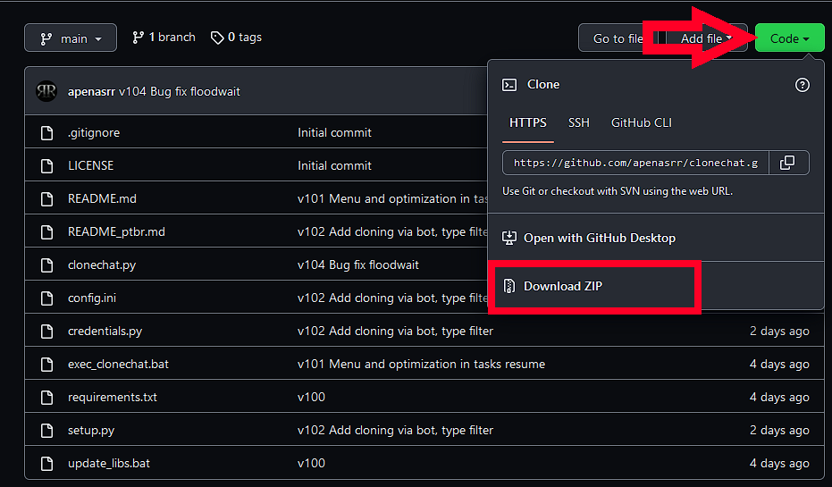

# Primeiros passos

## Instalação

### Python

!!! hint "Dica" 
    Caso já possua o Python instalado pule para a seção [Configurando o Ambiente](#configurando-o-ambiente).

Para o clonechat funcionar você precisa possuir o Python instalado no seu computador. Selecione o sistema operacional que está usando abaixo e siga o tutorial de instalação do Python.
!!! note ""
    === "Windows"
        1. Baixe o Python [neste link](https://www.python.org/downloads/).
        2. Abra o arquivo baixado e marque a opção `Add Python 3.?? to PATH`.
        !!! attention "Atenção"
            É importante marcar a opção `Add Python 3.?? to PATH`. Ela é importante para que o Python consiga ser reconhecido em todo o seu computador. Isso evitará problemas futuros.

            
        3) Clique em `Install now`.

        4) Espere terminar de instalar e feche o programa.

    === "Linux"
        Instale o Python com seu gerenciador de pacotes.

        Debian

        `sudo apt-get install python3`

        Mint
        
        `sudo apt install python3`

    === "Celular (Android)"
        Instale um aplicativo capaz de rodar o python. Recomendo o `pydroid 3`.

## Configurando o ambiente
Chegou a hora de baixar e configurar o clonechat.

### Baixando o Clonechat

De maneira geral você pode baixar o Clonechat de três formas. O download direto e o git vão te garantir as versões mais atualizadas. E via canal do Telegram (algumas vezes pode estar desatualizado).

!!! note ""
    === "Download Direto"
        Abra o repositório do clonechat [clicando aqui](https://github.com/apenasrr/clonechat)
      
        Clique em `Code` e vá em `Download ZIP`
        

        Abra a pasta onde o download foi salvo em seu computador e extraia o arquivo.

    === "git"
        Caso tenha o git instalado, no terminal digite: 

        ```git clone https://github.com/apenasrr/clonechat.git```

### Configurando o CloneChat
Para poder usar o clonechat é necessário que você cadastre suas credenciais da API do Telegram no arquivo `credentials.py`. Primeiramente vamos obter as credenciais abaixo:

#### Obtendo credenciais da API do Telegram
  
Para obter as credenciais para a API do Telegram:

  - Acesse a área de [gestão de apps](https://my.telegram.org/auth?to=apps) no site do telegram.
  - Entre com seu número de telefone em modelo internacional. Com prefixo `+55` para o caso de telefone brasileiro, seguido do DDD local e seu número de telefone.
    - Exemplo: Para telefone de São Paulo, com ddd 11, deverá ser digitado algo como: `+5511995429405`
  - Você receberá uma mensagem no Telegram contendo o código de autenticação. O código é composto por letras e números. Digite o código no local solicitado e prossiga.
  - Na nova página há um formulário que deve ser preenchido

        Título do aplicativo: digite qualquer coisa
        Nome curto: digite qualquer coisa entre 5 e 12 letras
        URL: ignore
        Plataforma: Ignore. Pode deixar marcado o padrão Android.

    - Finalize o formulário e aparecerá seus códigos de `api_id` e `api_hash`
    !!! attention "Atenção"
        **NÃO passe ou mostre suas credenciais para ninguém! Se for pedir ajuda oculte essas informações SEMPRE!**
  - Para assistir o processo em detalhes, assista [este vídeo](https://www.youtube.com/watch?v=8naENmP3rg4) que exemplifica tudo rapidamente.

#### Editando as credenciais

Com as credenciais nas mãos chegou a hora de usa-las.

1. Abra a pasta onde você extraiu o clonechat. 
2. No menu iniciar digite "Bloco de Notas" e aperte `ENTER`.
3. Arraste o arquivo `credentials.py` para dentro do bloco de notas para edita-lo.
4. Coloque as suas credenciais no arquivo. Caso o `api_id` e o `api_hash` gerados no passo [anterior](#obtendo-credenciais-da-api-do-telegram) sejam `1234896` e `f329148fajv991908`, respectivamente, o arquivo deve ficar dessa maneira:
  ``` {.py}
  api_id = 1234896
  api_hash = "f329148fajv991908"
  ```
5. Salve e feche.

#### Atualizando dependências

Para que o clonechat funcionar ele ainda depende de alguns outros programas. 
!!! note ""
    === "Windows"
        O clonechat vem com um arquivo para ajuda-lo a instalar as dependências.

        Basta executar o arquivo `update_libs.bat` e ao final da instalação apertar qualquer tecla.

    === "Linux"
        Abra o terminal do Linux e vá até a pasta do clonechat. 
        
        Execute o comando:

        `pip -r install requirements.txt`

    === "Celular"
        Abra o aplicativo Pydroid 3, toque no menu sanduíche (☰) e vá em `Pip`.
      
        Na aba `Install` instalaremos algumas dependências. Digite os nomes das bibliotecas abaixo no campo `Library name`, uma por vez, e depois clique em `Install`.

        - TgCrypto
        - pyrogram 

Se tudo ocorreu bem, neste momento o clonechat já está configurado e as dependências estão instaladas. Avance para a página seguinte para saber como usa-lo.
